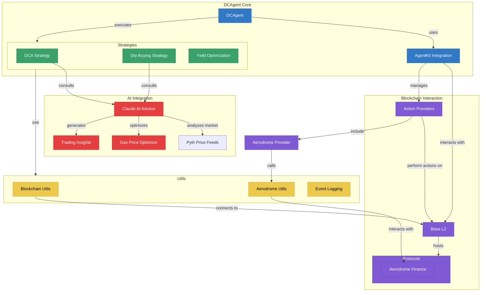

# DCAgent: Autonomous BTC Stacking Agent

DCAgent is an AI-powered autonomous agent that helps users stack Bitcoin through dollar-cost averaging (DCA) on Base using cbBTC.

## Core Features

- **Automated DCA**: Schedule regular BTC purchases at fixed intervals
- **Intelligent Dip Buying**: Automatically detect and buy price dips
- **Gas Optimization**: AI-powered transaction timing to minimize gas costs
- **Claude Integration**: Intelligent decision-making powered by Claude's AI capabilities
- **Yield Maximization**: Automatically stake and earn yield on your BTC holdings
- **Analytics Dashboard**: Track performance and get AI-generated insights

## System Architecture



## Tech Stack

- Python 3.10+
- Anthropic Claude for intelligent decision-making
- AgentKit for autonomous agent capabilities
- Base blockchain for low-cost transactions
- cbBTC as the trusted BTC wrapper token
- Web3.py for blockchain interactions
- Coinbase and Pyth price feeds for reliable BTC pricing

## Getting Started

### Prerequisites
- Python 3.10+
- Poetry (for dependency management)

### Installation
1. Clone the repository:
   ```bash
   git clone https://github.com/botmechanic/dc-agent.git
   cd dc-agent
   ```

2. Install dependencies:
   ```bash
   poetry install
   ```

3. Create a `.env` file with your configuration:
   ```
   BASE_RPC_URL=https://mainnet.base.org
   BASE_CHAIN_ID=8453
   PRIVATE_KEY=your_private_key_here
   DCA_AMOUNT=50
   DCA_INTERVAL=weekly
   ENABLE_DIP_BUYING=true
   ENABLE_YIELD_OPTIMIZATION=true
   ANTHROPIC_API_KEY=your_anthropic_api_key_here
   ENABLE_AI_ADVISOR=true
   ```

### Running DCAgent

#### Run Agent Only
```bash
poetry run python -m dcagent.main
```

#### Run Agent with Dashboard
```bash
poetry run ./run_dcagent.sh
# or directly:
poetry run streamlit run dashboard.py
```

#### Run Dashboard in Demo Mode
If you have Web3 connectivity issues or just want to see the dashboard interface:
```bash
poetry run ./run_dashboard_demo.sh
# or directly:
DEMO_MODE=true poetry run streamlit run dashboard.py
```

This will run the dashboard with simulated data, perfect for presentations.

#### Run AI Demo
To showcase Claude AI integration capabilities:
```bash
export ANTHROPIC_API_KEY=your_anthropic_api_key_here
poetry run ./run_ai_demo.sh
```

The dashboard will be available at http://localhost:8501

## Dashboard Features

The DCAgent dashboard provides a comprehensive visualization of your DCA agent's performance:

- **Overview**: See your current balances, BTC price, and portfolio growth
- **Performance**: Track DCA and dip buying performance with detailed metrics
- **Transactions**: Monitor all transactions with filtering by type and date
- **AI Insights**: View Claude's market analysis, predictions, and recommendations
- **Logs**: View system logs with filtering by log level

The dashboard also allows you to manually trigger actions like DCA execution and reward claiming.

## AI Capabilities

DCAgent leverages Claude AI for intelligent decision-making:

- **Market Analysis**: Claude analyzes BTC market trends to determine optimal buying times
- **Transaction Optimization**: AI-powered gas price and slippage recommendations
- **Price Predictions**: Short and medium-term BTC price forecasts
- **Strategy Adjustments**: Dynamic strategy modifications based on market conditions
- **Natural Language Insights**: Human-readable analysis of your portfolio performance

## Development Status

This project is currently under active development for the Ethereum SF Hackathon.
